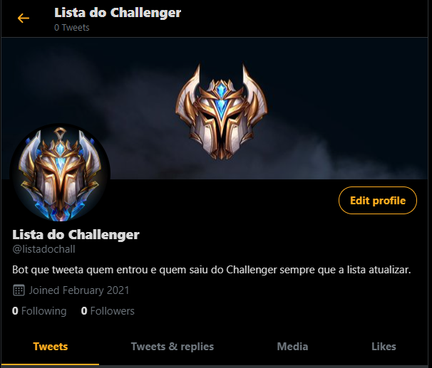

    <h2> ranking-tweet-bot</h2>  
    Um bot que tweeta quem saiu e quem entrou no top 200 (challenger) no league of legends.

    

## Como funciona?

Faz um scrapping no site leagueofgraphs.com e salva o nick de todos os challengers em <a src="https://github.com/alk0051/ranking-tweet-bot/blob/master/src/data/Lists/newList.json">newList.json</a> e em seguida compara com todos os nicks salvos em <a src="https://github.com/alk0051/ranking-tweet-bot/blob/master/src/data/Lists/oldList.json">oldList.json</a>. Os nicks que não estão presentes em oldList.json são salvos em <a src="https://github.com/alk0051/ranking-tweet-bot/blob/master/src/data/Players/newChallPlayers.json">newChallPlayes.json</a> e os players que estão presentes em oldList.json mas não em newList.json são salvos em <a src="https://github.com/alk0051/ranking-tweet-bot/blob/master/src/data/Players/oldChallPlayers.json">oldChallPlayers.json</a>. Após toda essa comparação o arquivo oldList.json é atualizado com a nova lista de challengers.
